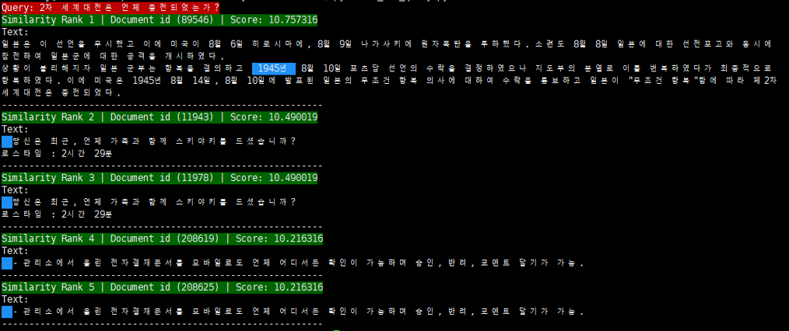
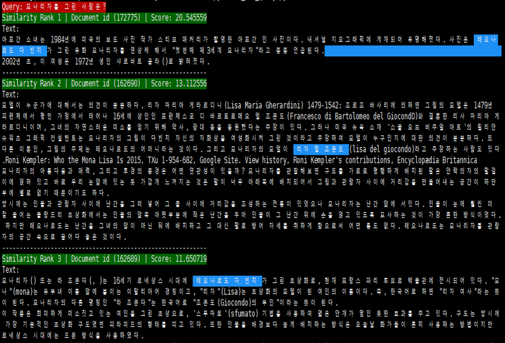

# **Elasticsearch MRC Task**

## **Elasticsearch 활용 한국어 위키피디아 MRC 태스크**

---

## **Notice**

- BM25 기반의 [Elasticsearch 7.9.3](https://www.elastic.co/kr/downloads/past-releases/elasticsearch-7-9-3) 검색 모델을 활용

- [Korpora/kowikitext](https://ko-nlp.github.io/Korpora/ko-docs/corpuslist/kowikitext.html) 사용하여 데이터셋 구성

- [Kakaobrain/pororo](https://kakaobrain.github.io/pororo/)에서 제공하는 MRC Task 적용

---

## **Process**

**1. Environment Setup**

- elasticsearch 7.9.3 다운로드

```console
wget https://artifacts.elastic.co/downloads/elasticsearch/elasticsearch-7.9.3-linux-x86_64.tar.gz

tar -zxvf elasticsearch-7.9.3-linux-x86_64.tar.gz
```

- 라이브러리 설치

```console
pip install -r requirements.txt
```

**2. Elasticsearch Engine 구동**

```console
./elasticsearch-7.9.3/bin/elasticsearch
```

**3. Korpora/kowikitext 다운로드 후 인덱싱**

```console
python 1_indexing.py
```

**4. Test Input Query 수행**

```console
python 2_test_query.py -query '{Input_Query}' -size {Input_Size}
```

- 데이터 집합에 BM25 기반 검색 수행 후 결과 도출

**5. MRC Task Input Query 수행**

```console
python 3_mrc_query.py -query '{Input_Query}' -size {Input_Size}
```

- 데이터 집합에 BM25 기반 검색 수행 후 MRC Task 적용

---

## **Result**

**MRC Task 적용**

- Query: 2차 세계대전은 언제 종전되었는가?

> 

- Query: 모나리자를 그린 사람은?

> 

---

## **Reference**
- [ko-nlp/Korpora](https://github.com/ko-nlp/Korpora)
- [kakaobrain/pororo](https://github.com/kakaobrain/pororo)
